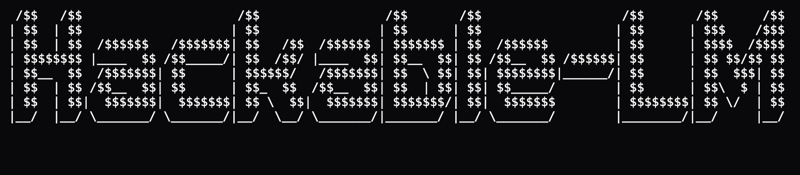

# hackable-lm

This repository is a hackable, modern, efficient implementation of a language
model and its training path.

The goal is to have a base that can be understood, changed, and measured. You
should be able to try one idea at a time, train it, compare it against the last
run, and decide whether the idea survived contact with the data.

This is not a repo whose main job is to collect the most cutting edge methods
or squeeze the best possible metric out of a fixed budget. Projects such as
`nanochat` and `modded-nanogpt` are closer to that goal. This repo intentionally
leans the other way: most components are implemented here, few external
libraries are used, and the important boundaries are meant to stay visible.

The current fast path has been tested on one NVIDIA GPU, on Ada and Ampere
class hardware, with CUDA + bf16 + Muon/AdamW + FlashAttention 2 + Triton
kernels where available + `torch.compile`. On the current baseline, training
MFU* is usually in the high 50s to low 60s, reported against the standard bf16 peak denominator.

\* Model FLOPS Utilization = [estimated FLOPs per token × tokens/sec] / GPU peak
  bf16 FLOPS. Estimated FLOPs per token = 6 × non-embedding params +
  Σ over layers of 12 × effective context × n_embd. The peak denominator is
  the GPU bf16 dense throughput (e.g. 181 TFLOPS for an L40).

## What Is Here

- `hackablebpe` Rust byte-level BPE tokenizer trainer, encoder, and decoder
- document-offset token memmap preprocessing
- decoder-only causal LM in `model.py`
- fused operator modules for QKV, residual/RMSNorm projections, SwiGLU, and LM head/loss
- local-window attention with periodic full attention
- Muon for transformer matrices and AdamW for embeddings, head, and small params
- strict CUDA training path in `train.py`
- run manifests for comparing one change at a time
- EleutherAI `lm-eval` adapter for benchmark evaluation

The shape of the code matters. Architecture changes should mostly live in
`model.py`, optimizer changes in `optim.py`, data sampling in `data.py`, and
tokenizer/preprocessing changes in `tokenizer.py` and `prepare_data.py`.

## Setup

The lockfile targets the CUDA Linux x86_64 training path. If you run setup
manually, install `uv` first. The FineWeb script below can bootstrap it.

```bash
make setup
```

This builds the local Rust tokenizer trainer and Python extension, then syncs the `uv` environment.
You need a Rust toolchain, a CUDA-capable PyTorch environment, and
FlashAttention 2. CPU paths exist for tests only, not for real training.

## Run Training

The built-in FineWeb script downloads data, trains a tokenizer, prepares token
memmaps, trains the model, evaluates validation BPB and the standard `lm-eval`
benchmarks at each checkpoint, and prints the MLflow command at the end. Its
default edu source is
`HuggingFaceTB/smollm-corpus` with config `fineweb-edu-dedup`.

```bash
scripts/run_fineweb.sh 12
```

The first argument is the depth preset. The common presets are:

```bash
scripts/run_fineweb.sh 6
scripts/run_fineweb.sh 12
scripts/run_fineweb.sh 18
```

Useful overrides are environment variables:

```bash
RUN_NAME=idea_x_d12 FINEWEB_DOCS=1000000 scripts/run_fineweb.sh 12
```

For your own already-prepared text or JSONL data, the manual path is:

```bash
uv run python prepare_data.py all \
  --input data/raw/*.txt \
  --vocab-size 32768 \
  --output data/processed

uv run python train.py \
  --depth 12 \
  --data data/processed \
  --run-name d12
```

Checkpoint evaluation is enabled by default. Pass `--eval-final-only` to
evaluate only the final checkpoint, `--disable-benchmarks` to keep validation
BPB only, or `--disable-eval` to skip both validation and benchmarks.

To inspect local MLflow logs:

```bash
uv run mlflow ui --backend-store-uri file://$(pwd)/runs/mlruns
```

## Comparing Ideas

The intended workflow is boring on purpose:

1. Run a baseline.
2. Make one local change.
3. Run the candidate.
4. Compare the manifests and metrics.

For fair comparisons, keep the boring fields aligned: data hashes, tokenizer
hash, split seed, data shuffle seed, sequence length, global batch tokens,
optimizer grouping, precision, attention backend, module backends, scaling policy, and seed.

When a candidate should inherit the baseline budget, use `--match-run`:

```bash
uv run python train.py \
  --match-run runs/d12/manifest.json \
  --comparison-mode same_tokens \
  --data data/processed \
  --candidate-label idea_x \
  --run-name idea_x_same_tokens

uv run python repro.py compare \
  runs/d12/manifest.json \
  runs/idea_x_same_tokens/manifest.json \
  --fail-on-warning
```

`same_depth` is good for a first pass. Use `same_params` when the change alters
capacity, `same_bytes` for tokenizer or preprocessing changes, and `same_flops`
or `same_time` for efficiency claims.

## WSD Warmdown Resumes

For WSD schedules, shorter-budget runs can reuse any normal checkpoint from a
longer run and continue to a requested total budget. The target budget defines
the normal WSD warmdown boundary, so the resumed run stays on the plateau until
that boundary and then decays:

```bash
uv run python train.py \
  --depth 12 \
  --data data/processed \
  --resume runs/d12_10k/checkpoints/latest.pt \
  --warmdown-to-target-steps 2000 \
  --run-name d12_2k_from_long
```

For token-per-parameter budgets, use:

```bash
uv run python train.py \
  --depth 12 \
  --data data/processed \
  --resume runs/d12_10k/checkpoints/latest.pt \
  --warmdown-to-target-tpp 20 \
  --run-name d12_20tpp_from_long
```

The checkpoint must resume at or before the target budget's WSD decay start; if
the requested target would have started warmdown before the checkpoint, training
exits with an error. The run ends at the requested total step or
tokens-per-scaling-param budget, restores the data-loader cursor, and rejects
unexpected provenance mismatches without needing `--allow-resume-mismatch`.

## Eval

Training runs validation BPB and the standard benchmark suite whenever it writes
a checkpoint, and reports those metrics to MLflow. Use `--eval-final-only` when
you want intermediate checkpoints saved without intermediate eval runs.

The default `standard` suite runs:

- 0-shot commonsense: HellaSwag, PIQA, ARC-Easy, ARC-Challenge, WinoGrande, OpenBookQA, BoolQ
- 0-shot LAMBADA: `lambada_openai`

## Tests

```bash
make test
```

On a non-CUDA machine:

```bash
uv run pytest -m "not cuda"
```

The tests are correctness smoke checks. They are not a fallback training path.
